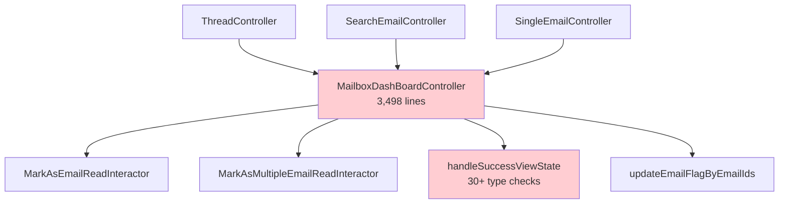
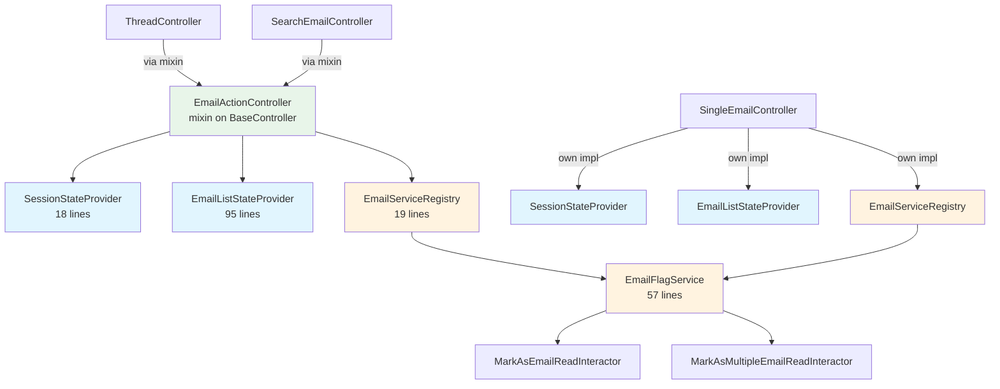
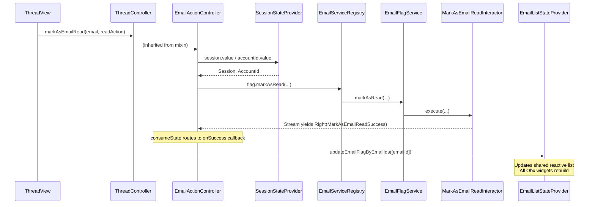
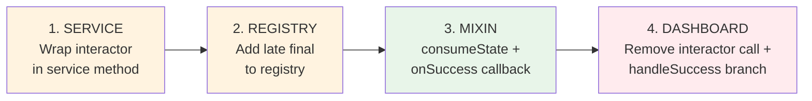

# Dependency Graph: markAsEmailRead Migration

## Before: Hub-and-Spoke (All through Dashboard)

## After: Provider + Service + Callback

## Data Flow: Single markAsEmailRead Call

## Recipe: Apply to Any Action

## Migration Roadmap

```mermaid
gantt
    title Action Migration from Dashboard
    dateFormat X
    axisFormat %s

    section EmailFlagService
    markAsEmailRead       :done, 0, 1
    markAsReadMultiple    :done, 0, 1
    markAsStarEmail       :active, 1, 2
    markAsStarMultiple    :2, 3

    section EmailMoveService
    moveToMailbox         :3, 4
    moveMultiple          :4, 5
    moveToTrash           :5, 6

    section EmailDeleteService
    deletePermanently     :6, 7
    deleteMultiple        :7, 8
    emptyTrash            :8, 9

    section ComposerSendService
    sendEmail             :9, 10
    saveDraft             :10, 11
```

