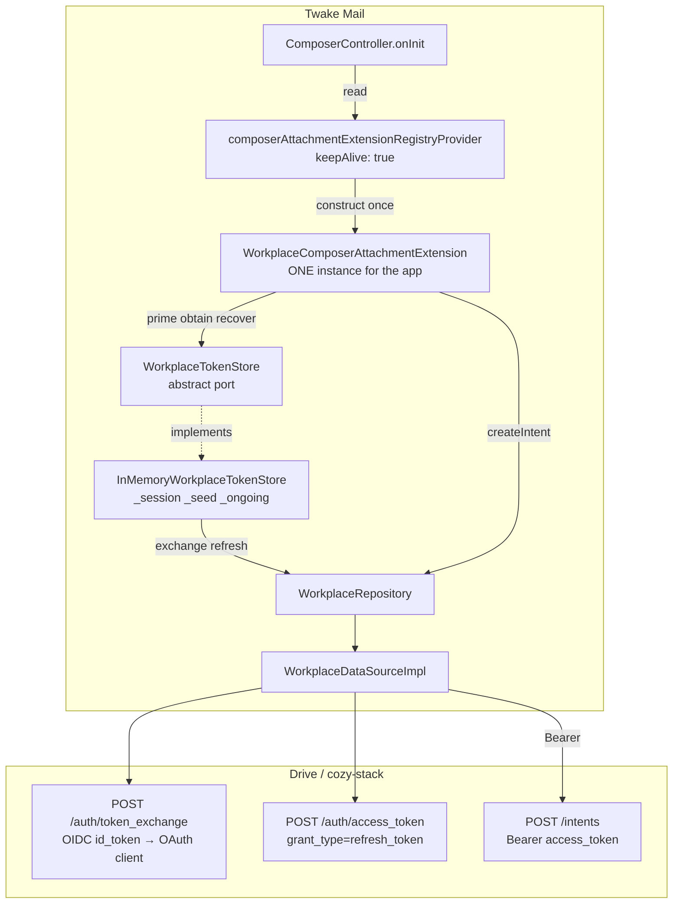
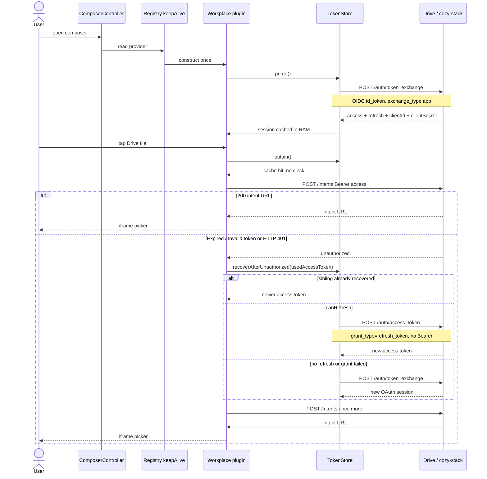
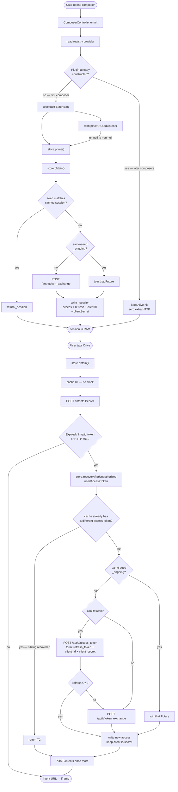
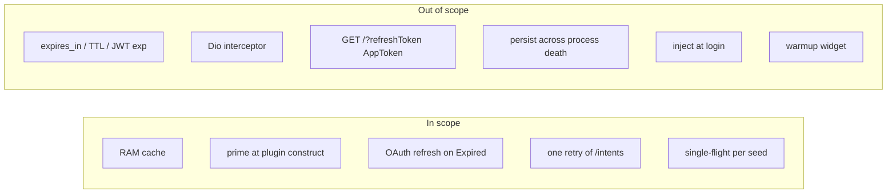
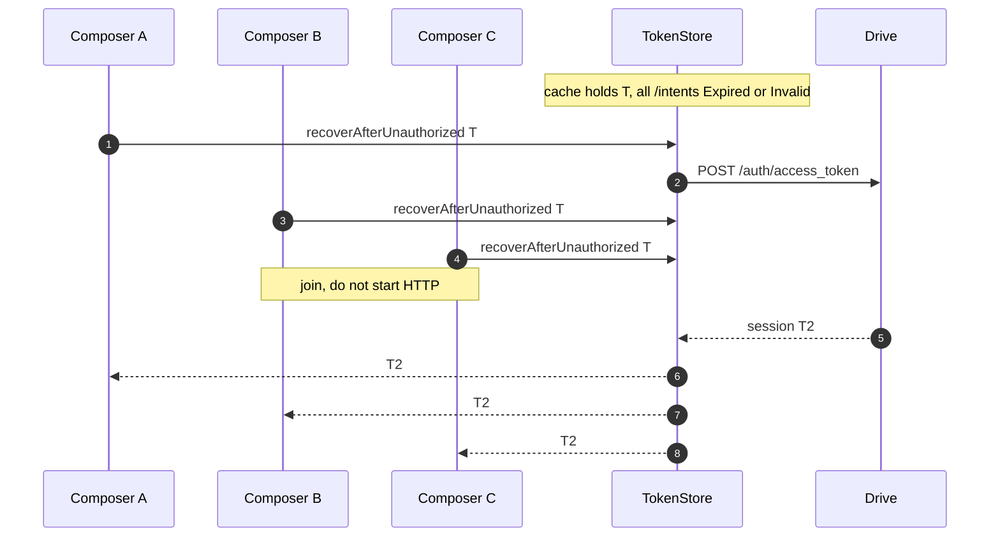
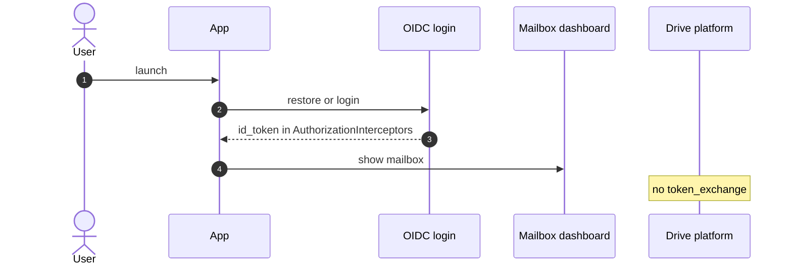
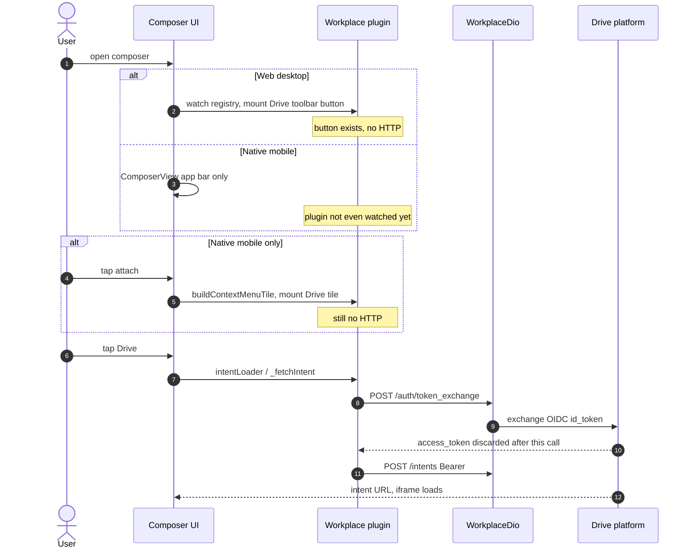
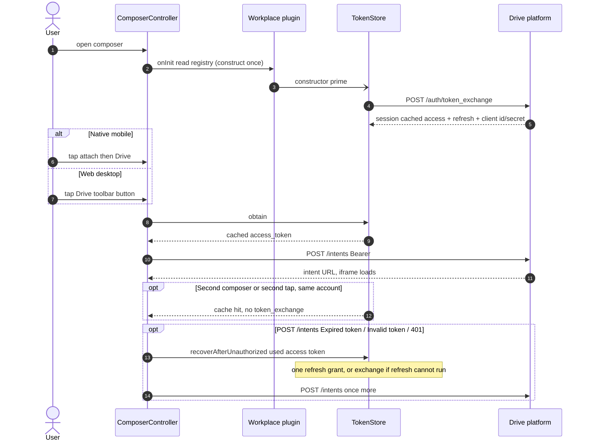

# Workplace token exchange: TokenStore cache, 401 retry, composer-open prime

## Overview

Today every Drive picker tap pays two sequential round-trips inside lazy
`intentLoader()` before the iframe starts:

```
POST {platform}/auth/token_exchange  -> access_token
POST {platform}/intents              -> intent URL (Bearer access_token)
```

The exchanged token is discarded. This plan caches the OAuth session in memory,
primes at composer open, and on Expired/Invalid token from `/intents` refreshes
like cozy-client `fetchJSON` — **no `expires_in` / `expiresAt` clock**. Still a
workaround, not disk persistence or a Dio interceptor.

**Do not implement together with**
`plans/260826-1717-GH-4728-workplace-token-exchange-interceptor-cache`
(interceptor-owned cache). Same files, opposite shape. Pick one.

## Visual summary

Preview this file: the diagrams below are the whole plan.

### Architecture



### Sequence: prime then Drive tap



### Runtime: inject, tap, recover

No TTL. Cache until Drive says Expired / Invalid / 401.



### What is not in this plan



### Why a TokenStore, not a Dio interceptor

`WorkplaceDio` has one authenticated call (`POST /intents`). `token_exchange` and
`POST /auth/access_token` must stay unauthenticated (credentials in the body).
An interceptor is the N-endpoint tool. Refresh is store logic, matching
[cozy-client `fetchJSON`](https://github.com/linagora/cozy-client/blob/master/packages/cozy-stack-client/src/CozyStackClient.js)
(catch Expired/Invalid → single-flight `refreshToken` → retry once).

State lives in **one** object behind an abstract port. Extension, widgets, mixin,
and `WorkplaceDio` stay dumb.

### Store abstraction

The extension never sees cache fields or HTTP. It only calls this port
(`workplace/lib/domain/repository/workplace_token_store.dart`):

```dart
abstract class WorkplaceTokenStore {
  Future<WorkplaceTokenSession> obtain({
    required Uri platformUrl,
    required String oidcIdToken,
  });

  Future<WorkplaceTokenSession> recoverAfterUnauthorized({
    required String usedAccessToken,
    required Uri platformUrl,
    required String oidcIdToken,
  });

  Future<void> prime({
    Uri? platformUrl,
    String? oidcIdToken,
  });
}
```

| Method | Contract |
|---|---|
| `obtain` | Return a usable session for this `(platformUrl, oidcIdToken)`. Cache hit if seed matches. Else one `token_exchange`. Same-seed concurrent calls share one HTTP Future. |
| `recoverAfterUnauthorized` | Called after `/intents` Expired/Invalid/401 with the **access token that failed**. If cache already holds a **different** access token, return it (sibling recovered). Else refresh grant, else `token_exchange`. Must **not** delegate to `obtain()` (that would return the dead token). |
| `prime` | Fire-and-forget `obtain`. No-op if uri or oidc is null. Swallow errors. |

Impl: `InMemoryWorkplaceTokenStore` in
`workplace/lib/data/network/in_memory_workplace_token_store.dart`.
RAM only. `_session`, `_seed`, `_ongoing`, `_ongoingSeed` stay private on the
impl. HTTP is injected:

```dart
typedef WorkplaceTokenExchange = Future<WorkplaceTokenSession> Function(
  Uri platformUrl,
  String oidcIdToken,
);

typedef WorkplaceTokenRefresh = Future<WorkplaceTokenSession> Function(
  Uri platformUrl,
  WorkplaceTokenSession current,
);

class InMemoryWorkplaceTokenStore implements WorkplaceTokenStore {
  InMemoryWorkplaceTokenStore({
    required WorkplaceTokenExchange exchange,
    required WorkplaceTokenRefresh refresh,
  });
}
```

Plugin field type is the **abstract** store:

```dart
late final WorkplaceTokenStore _tokenStore = InMemoryWorkplaceTokenStore(
  exchange: _repository.exchangeToken,
  refresh: _repository.refreshToken,
);
```

### Target flow

```
Composer open (first ComposerController.onInit)
  -> read registry provider -> construct plugin -> store.prime()

later composers onInit
  -> read keepAlive registry -> constructor does not run again

workplaceUri null -> non-null
  -> extension listener -> store.prime()

Tap Drive
  -> store.obtain()                                // cache hit, no TTL
  -> POST /intents

Expired / Invalid token on /intents (cozy-client match, or HTTP 401)
  -> store.recoverAfterUnauthorized(the access token that failed)
       // sibling already minted T2 → return T2
       // else POST /auth/access_token (refresh grant)
       // else POST /auth/token_exchange
  -> POST /intents once more
```

### Key decisions

| Decision | Choice | Why |
|---|---|---|
| Cache owner | Abstract `WorkplaceTokenStore`; impl `InMemoryWorkplaceTokenStore` | Extension depends on the port. Only the impl holds RAM + single-flight. |
| Session shape | `accessToken` + `refreshToken?` + `clientId?` + `clientSecret?` | token_exchange already returns all four. Refresh grant needs client id/secret. **No `expiresAt`.** |
| Expiry | **None.** Trust Drive. | cozy-stack omits `expires_in`. Guessing TTL causes extra exchanges or stale taps. cozy-client does not clock tokens; it refreshes when the stack says Expired/Invalid. |
| Recover trigger | cozy-client `fetchJSON` match + HTTP 401 | `Expired token` / `Invalid JWT token` / `Invalid token` in body or `WWW-Authenticate` (`access_token_expired` / `invalid_token`). Also status 401 (Dio body is often empty). |
| Recover action | `recoverAfterUnauthorized` then retry `/intents` once | Mirror cozy-client: refresh then retry the **same** call once. `_createIntent` unwraps to raw `DioException` (verified). |
| Refresh HTTP | `POST /auth/access_token` form | OAuth client from token_exchange, not AppToken `GET /?refreshToken` (that needs cookies). Fallback: `token_exchange` if refresh credentials missing or the grant fails. |
| Dual recover | used-access compare + **same-seed single-flight** | If cache already holds a different access token, return it. Same-seed callers **join** `_ongoing`. Write cache only if `identical(_ongoing, started)`. |
| Prime time | **Plugin construct** + uri `null → non-null` | Prime in the keepAlive extension constructor, not a per-composer widget. Force-create the plugin from `ComposerController.onInit` so native is not stuck waiting for attach-menu. Do **not** inject at login. |
| Multi-composer | **One store for the app** | Drive token is account-scoped, not composer-scoped. See below. |
| Signatures | Keep `createIntent(... accessToken:)` | Workaround. Do not strip the token through 4 layers. |
| Persistence | Out of scope | RAM only. Process death → next composer open exchanges again. |

### Multiple composers

Web can keep several composers at once (`ComposerManager.composers` is an
`RxMap<String, ComposerView>`, each with a tagged `ComposerController`).

The Drive token is **not** per composer. It is minted from the current OIDC
`id_token` + platform URL. Those are account-level
(`AuthorizationInterceptors.currentOidcIdToken`, one FQDN notifier).

`composerAttachmentExtensionRegistryProvider` is `@Riverpod(keepAlive: true)` and
builds **one** `WorkplaceComposerAttachmentExtension` for the app. Every
composer's toolbar calls `buildToolbarButton(composerId: thatId)` on that same
plugin. Per-composer data is only attachment remaining-bytes and pick dispatch.

So the store **must** be a field on that single extension (or injected into it),
never on `ComposerController` / picker State.

| Scenario | What happens |
|---|---|
| Composer A opens, then B | A's `onInit` constructs the plugin (one exchange). B's `onInit` only `read`s keepAlive. Cache hit. |
| 8 composers open in the same tick (story 8) | First `onInit` constructs + primes. The other seven `read` the same instance. Still **one** `token_exchange`. |
| A and B tap Drive together, cache warm | Two `/intents`, zero exchanges. |
| A and B tap together, cache empty | First `obtain()` starts **one** `token_exchange`. The other joins. |
| A and B `/intents` both Expired/Invalid on T | Each `recoverAfterUnauthorized(T)`. One refresh (or exchange if no grant); joiners reuse T2. Each retries **its own** `/intents`. |
| All recovers see T still cached (story 9) | N `recoverAfterUnauthorized(T)`. Still **one** refresh HTTP. |
| A closes, B stays | Store is on the keepAlive plugin, not on A's controller. Token stays. Do **not** invalidate on composer close. |
| Account switch / OIDC refresh | `oidcIdToken` seed changes. Next `obtain()` misses cache and exchanges. No logout hook. |
| Per-composer store | Reject. N composers = N exchanges for the same account token. |

Stampede (stories 8–9): same-seed callers **join** one mint (`token_exchange` or
`access_token` refresh). A failed mint errors every joiner; the next tap starts
clean. Each composer still retries **its own** `/intents` after Expired/Invalid.




### User flows: app open to Drive tap

App open never calls Drive `token_exchange`. The OIDC `id_token` already exists
from login. Drive exchange starts at composer open (target) or Drive tap (today).

#### 1. App open — same on mobile and web



#### 2. Today — exchange only when the user taps Drive

Web desktop mounts the Drive toolbar button at composer open (`BottomBarComposerWidget`
→ `ExternalAttachmentComposerButton` → `DriveAttachmentPickerButton`). Native
mobile does not: Drive is a tile built inside `attachFileAction`. Neither path
exchanges until tap.



#### 3. Target — TokenStore primes when the plugin is constructed



## Phases

| Phase | Name | Status |
|-------|------|--------|
| 1 | [Token session and store](./phase-01-token-session-and-store.md) | Pending |
| 2 | [Wire obtain and 401 retry](./phase-02-wire-obtain-and-401-retry.md) | Pending |
| 3 | [Prime at composer open](./phase-03-prime-at-composer-open.md) | Pending |
| 4 | [Tests](./phase-04-tests.md) | Pending |
| 5 | [Record the decision in ADR 0106](./phase-05-record-the-decision-in-adr-0106.md) | Pending |

## Success criteria

- [ ] Second picker open (same account) issues **no** `token_exchange`.
- [ ] First picker open after composer open issues **no** exchange at tap time (prime already did it), including native mobile.
- [ ] Two composers open: still **one** cached session object (account-scoped).
- [ ] N concurrent `obtain()` / `prime()` while the cache is empty issue **one** `token_exchange`.
- [ ] Closing composer A does not drop the session used by composer B.
- [ ] 401 / Expired / Invalid on `POST /intents` calls `recoverAfterUnauthorized` and retries **once**. Extra composers join the same refresh (or exchange). Each retries their own `/intents`.
- [ ] Recover with a live refresh grant issues **no** `token_exchange`.
- [ ] Recover with no refresh credentials, or a failed grant, issues **one** `token_exchange`.
- [ ] Seed change (OIDC token or platform URL) forces a new exchange.
- [ ] Cached session is reused until Drive rejects it. **No TTL / `expiresAt` / `expires_in`.**
- [ ] First `ComposerController.onInit` constructs the plugin and primes (native included, no attach menu).
- [ ] Second composer `onInit` issues **zero** extra `token_exchange`.
- [ ] Composer open while `workplaceUri` is null, then uri becomes non-null: one `prime` / exchange before tap.
- [ ] No warmup widget / `onComposerOpened` on the plugin interface.
- [ ] `fvm flutter test` green in `workplace/` and touched `lib/` tests.

## Out of scope

- Dio interceptor / dropping `accessToken` from `createIntent`.
- AppToken `GET /?refreshToken` (cookie session). We are an OAuth client from `token_exchange`.
- Persisting the Drive session across process death.
- Re-prime timer / JWT `exp` decode / `expires_in` guess.
- `force` flags or generation counters to pair two composers' `/intents` retries.
- Download path (signed `downloadLink`, not this token).

## Dependencies

Competing alternative (do not merge both):
`plans/260826-1717-GH-4728-workplace-token-exchange-interceptor-cache`

No `blockedBy` / `blocks`: they are mutually exclusive, not sequential.

## Unresolved questions

None that block this workaround.

### Resolved: `expires_in` — do not use it

cozy-stack `AccessTokenReponse` has no `expires_in`. Do not invent `expiresAt` or
a 5 min TTL. Cache until Drive returns Expired/Invalid (cozy-client `fetchJSON`).

### Resolved: refresh grant

`token_exchange` mints a normal OAuth client. Refresh is
`POST /auth/access_token` with `grant_type=refresh_token` + `client_id` +
`client_secret` ([OAuthClient.refreshToken](https://github.com/linagora/cozy-client/blob/master/packages/cozy-stack-client/src/OAuthClient.js)).
Not `GET /?refreshToken` (AppToken / cookie). Not a second `token_exchange` unless
the grant cannot run.
