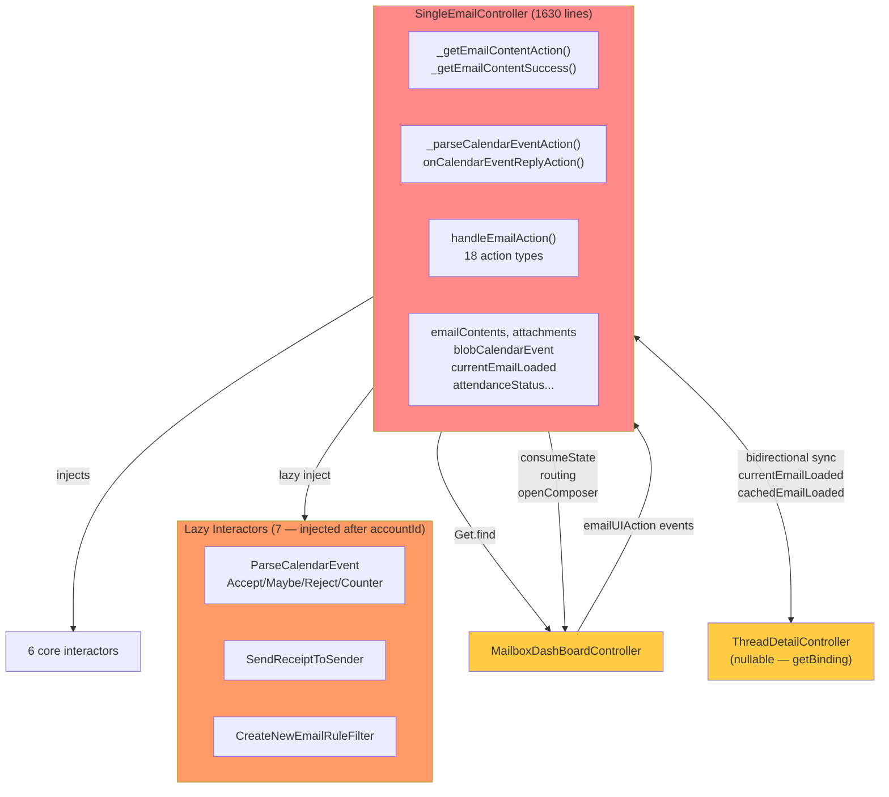
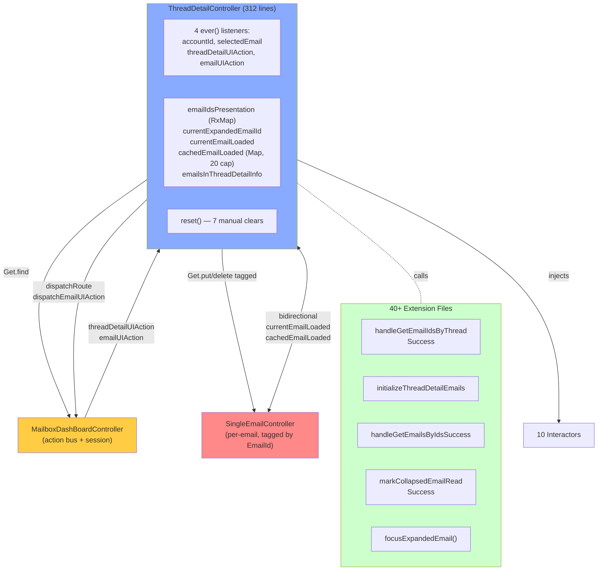

# Controller Refactoring Analysis
**Date:** 2026-04-10 | **Branch:** master

Scope: `MailboxDashboardController` (3521 lines), `ComposerController` (2389 lines), `SingleEmailController` (1630 lines), `ThreadDetailController` (312 lines) — **7852 total lines**

---

## Table of Contents
1. [MailboxDashboardController](#1-mailboxdashboardcontroller)
2. [ComposerController](#2-composercontroller)
3. [SingleEmailController](#3-singleemailcontroller)
4. [ThreadDetailController](#4-threaddetailcontroller)
5. [Cross-Controller Relationships](#5-cross-controller-relationships)
6. [Shared Complexity Patterns](#6-shared-complexity-patterns)
7. [Refactoring Priorities](#7-refactoring-priorities)

---

## 1. MailboxDashboardController

**File:** `lib/features/mailbox_dashboard/presentation/controller/mailbox_dashboard_controller.dart` (3521 lines)

### Role
Primary orchestration hub for the entire email dashboard. Acts as a **God Object** coordinating: email/mailbox operations, composer lifecycle, search, auth, vacation responder, notifications, downloads, labels, AI scribe, and premium features.

### Dependencies

**31 constructor-injected interactors** (grouped):
| Group | Interactors |
|-------|-------------|
| Email actions | `MoveToMailboxInteractor`, `DeleteEmailPermanentlyInteractor`, `MarkAsEmailReadInteractor`, `MarkAsStarEmailInteractor`, `UnsubscribeEmailInteractor`, `AddALabelToAnEmailInteractor`, `RemoveALabelFromAnEmailInteractor` |
| Bulk email | `MarkAsMultipleEmailReadInteractor`, `MarkAsStarMultipleEmailInteractor`, `MoveMultipleEmailToMailboxInteractor`, `DeleteMultipleEmailsPermanentlyInteractor` |
| Mailbox | `MarkAsMailboxReadInteractor`, `ClearMailboxInteractor`, `EmptyTrashFolderInteractor`, `EmptySpamFolderInteractor` |
| Composer | `SendEmailInteractor`, `SaveTextFormattingMenuStateInteractor`, `GetComposerCacheOnWebInteractor`, `RemoveComposerCacheByIdOnWebInteractor`, `RemoveAllComposerCacheOnWebInteractor` |
| Sending queue | `StoreSendingEmailInteractor`, `UpdateSendingEmailInteractor`, `GetAllSendingEmailInteractor`, `DeleteSendingEmailInteractor` |
| Recovery | `RestoreDeletedMessageInteractor`, `GetRestoredDeletedMessageInteractor` |
| Other | `StoreSessionInteractor`, `GetAllIdentitiesInteractor`, `GetEmailByIdInteractor`, `GetStoredEmailSortOrderInteractor`, `StoreEmailSortOrderInteractor` |

**Lazy-injected via `Get.find` (9):** `GetAllVacationInteractor`, `UpdateVacationInteractor`, `GetAutoCompleteInteractor`, `IOSNotificationManager`, `GetServerSettingInteractor`, `CreateNewEmailRuleFilterInteractor`, `SaveLanguageInteractor`, `GetTextFormattingMenuStateInteractor`, `GetAIScribeConfigInteractor`

**Auth interactors (4):** `GetAuthenticationInfoInteractor`, `GetStoredOidcConfigurationInteractor`, `GetTokenOIDCInteractor`, `GetIdentityCacheOnWebInteractor`

**Cross-controller dependencies:**
- `SearchController`, `DownloadController`, `AppGridDashboardController`, `SpamReportController`, `NetworkConnectionController`, `LabelController`, `ComposerManager`, `PaywallController` (dynamic)

**Managers/services:** `EmailReceiveManager`, `LocalNotificationManager`, `FcmService`, `WebSocketController`, `BackButtonInterceptor`, `SentryEcosystem`

**Mixins (7):** `ContactSupportMixin`, `OwnEmailAddressMixin`, `SaaSPremiumMixin`, `AiScribeMixin`, `SearchLabelFilterModalMixin`, `AddLabelToEmailMixin`, `HandleTeamMailboxMixin`

### Lifecycle

```
onInit() [L407]
  ├─ Register Sentry (mobile)
  ├─ Register file sharing stream (mobile)
  ├─ Register deep links (mobile)
  ├─ _registerStreamListener() ── core stream hub
  ├─ registerLabelReactiveObxListener()
  ├─ Add BackButtonInterceptor
  └─ Schedule ApplicationManager.initUserAgent()

onReady() [L428]
  ├─ Web: init searchFilterScrollController + reactive listeners
  ├─ iOS: register pending notification stream
  ├─ _handleArguments() ── route initial navigation
  ├─ _loadAppGrid()
  └─ loadAIScribeConfig()

onClose() [L3457]  ── 35-line manual teardown
  ├─ Dispose scroll controllers
  ├─ Cancel all StreamSubscriptions
  ├─ Close all StreamControllers
  ├─ Close notification managers, WebSocket, PaywallController
  ├─ Nullify cached data (identities, outbox, session, mailboxes)
  └─ Dispose Worker RxVariables
```

### Communication Map

**Action dispatch pattern** — Dashboard is the message bus:
- `dashBoardAction` (Rxn\<UIAction\>) — keyboard shortcuts, menu
- `mailboxUIAction` (Rxn\<MailboxUIAction\>) — sidebar events
- `emailUIAction` (Rxn\<EmailUIAction\>) — email list events
- `threadDetailUIAction` (Rxn\<ThreadDetailUIAction\>) — thread detail events

**Stream-based:**
- `progressStateController` — broadcasts `Either<Failure, Success>` from all interactors
- `_refreshActionEventController` — debounced refresh on app resume
- Download actions via `ever(downloadController.downloadUIAction)`

**Pattern:** Hub-and-spoke. Dashboard → all features. Other controllers do NOT hold a reference back to dashboard (except Composer which violates this).

### Complexity Problems

| # | Problem | Severity |
|---|---------|----------|
| 1 | **80+ Rx variables + 5+ state maps** — state explosion across lines 307–370 | HIGH |
| 2 | **`handleSuccessViewState` is 113 lines** with 50+ `else if` chains [L463–575] | HIGH |
| 3 | **God Object** — 3521 lines, 331 methods, owns 10+ unrelated concerns | HIGH |
| 4 | **37+ extension files** fragment business logic; IDE outline is useless | HIGH |
| 5 | **29 positional constructor params** — wrong-order bugs, untestable | MEDIUM |
| 6 | **7 lazy `Get.find()` in methods** — breaks testability, null risk | MEDIUM |
| 7 | **6+ StreamSubscriptions** — no central registry, manual cancel = leak risk | MEDIUM |
| 8 | **Platform `if/else` in lifecycle** — `onInit/onReady/onClose` have platform branches | MEDIUM |
| 9 | **`_moveSelectedMultipleEmailToMailboxSuccess` is 100+ lines** with 5-level nesting | MEDIUM |
| 10 | **No error classification** — `setErrorState()` used for auth errors, network errors, business errors equally | LOW |

### Mermaid Graph

```mermaid
graph TB
    subgraph DASH["MailboxDashboardController (3521 lines)"]
        direction TB
        ACTIONS["Action Bus\ndashBoardAction\nmailboxUIAction\nemailUIAction\nthreadDetailUIAction"]
        STATE["80+ Rx Variables\n31 Interactors\n7 Lazy Interactors"]
        STREAM["progressStateController\nrefreshActionController"]
    end

    subgraph INTERACTORS["Injected Interactors (31)"]
        EMAIL_OPS["Email Ops\n(move/delete/star/read)"]
        BULK["Bulk Email Ops"]
        MBX["Mailbox Ops"]
        COMPOSE["Composer Ops"]
        QUEUE["Sending Queue"]
    end

    subgraph CONTROLLERS["Cross-Controller"]
        SEARCH["SearchController"]
        DOWNLOAD["DownloadController"]
        LABEL["LabelController"]
        COMPOSER_MGR["ComposerManager"]
        NETWORK["NetworkConnectionController"]
    end

    subgraph CONSUMERS["Action Consumers"]
        THREAD["ThreadDetailController"]
        SINGLE["SingleEmailController"]
        COMPOSER["ComposerController"]
        MAILBOX_VIEW["MailboxView"]
    end

    DASH -->|injects| INTERACTORS
    DASH -->|Get.find| CONTROLLERS
    DASH -->|dispatches| ACTIONS
    ACTIONS -->|ever()| CONSUMERS
    STREAM -->|consumeState()| DASH

    style DASH fill:#ff8888
    style ACTIONS fill:#ffcc44
    style STATE fill:#ffcc44
```

---

## 2. ComposerController

**File:** `lib/features/composer/presentation/composer_controller.dart` (2389 lines)

### Role
Manages the full email composition experience: creation, editing, drafts, sending, attachments, recipients, identities, signatures, templates, and composer UI state (minimize/full/hidden modes).

### Dependencies

**15 constructor-injected interactors:**
`LocalFilePickerInteractor`, `LocalImagePickerInteractor`, `GetEmailContentInteractor`, `GetAllIdentitiesInteractor`, `RemoveComposerCacheByIdOnWebInteractor`, `SaveComposerCacheOnWebInteractor`, `DownloadImageAsBase64Interactor`, `TransformHtmlEmailContentInteractor`, `GetServerSettingInteractor`, `CreateNewAndSendEmailInteractor`, `CreateNewAndSaveEmailToDraftsInteractor`, `PrintEmailInteractor`, `SaveTemplateEmailInteractor`

**Lazy via `getBinding` (4):** `GetAllAutoCompleteInteractor`, `GetAutoCompleteInteractor`, `GetDeviceContactSuggestionsInteractor`, `RestoreEmailInlineImagesInteractor`

**Controllers:** `MailboxDashBoardController` (tight coupling), `NetworkConnectionController`, `UploadController`, `RichTextWebController` (web), `RichTextMobileTabletController` (mobile/tablet)

**Mixins (4):** `DragDropFileMixin`, `AutoCompleteResultMixin`, `EditorViewMixin`, `AiScribeMixin`

**45 extension files** in `extensions/` covering setup, handlers, and state

### Lifecycle

```
onInit() [L295]
  ├─ Platform detect → init RichText controller
  ├─ createFocusNodeInput() ── 11 focus nodes
  ├─ _listenStreamEvent() ── subscribe uploadController.uploadInlineViewState
  ├─ _triggerBrowserEventListener() ── drag-drop events (web)
  ├─ scrollController.addListener() ── suggestion box auto-close
  ├─ _beforeReconnectManager.addListener()
  └─ onKeyboardShortcutInit()

onReady() [L314]
  ├─ _triggerBrowserEventListener() (web activate)
  ├─ setupComposer() ── MAIN init: parse args, recipients, subject, content, attachments, identity
  └─ _checkContactPermission() ── 500ms delay (mobile)

onClose() [L326]
  ├─ Clear transient state fields
  ├─ Dispatch UIClosedState() to streams
  ├─ Cancel all stream subscriptions
  ├─ Remove focus node listeners
  ├─ Dispose platform-specific controllers
  └─ onKeyboardShortcutDispose()

dispose() [L360]
  ├─ Dispose 11 FocusNodes
  ├─ Dispose 6 TextEditingControllers
  ├─ Dispose 4 ScrollControllers
  └─ Dispose worker subscriptions
```

### Communication Map

**To MailboxDashBoardController:**
- `mailboxDashBoardController.closeComposer()` — close with result
- `mailboxDashBoardController.updateTextFormattingMenuState()` — save formatting state
- `mailboxDashBoardController.consumeState()` — send draft/send results
- `mailboxDashBoardController.paywallController?.navigateToPaywall()` — quota exceeded
- `mailboxDashBoardController.localFileDraggableAppState` ← drag state writes

**From UploadController:**
- `ever(uploadController.uploadInlineViewState)` — inline image upload results

**Browser events (web):**
- `html.window.onDragEnter/Over/Leave/Drop/Blur` subscriptions

**Reconnection:** Implements `BeforeReconnectHandler` → `onBeforeReconnect` / `onUnloadBrowserListener`

### Complexity Problems

| # | Problem | Severity |
|---|---------|----------|
| 1 | **20+ Rx observables + mutable Lists** — state explosion, no single state model | HIGH |
| 2 | **God Object** — 2389 lines, owns composition + attachment + identity + autocomplete + template + print + cache + keyboard | HIGH |
| 3 | **`handleClickSendButton()` is 85 lines** with 6 nested dialog/validation flows | HIGH |
| 4 | **40+ `if (PlatformInfo.isWeb)`** branches — platform divergence throughout | HIGH |
| 5 | **Tight coupling to MailboxDashBoardController** — accesses session, account, mailboxes, settings, paywall directly | HIGH |
| 6 | **45 extension files** — core logic scattered across filesystem | MEDIUM |
| 7 | **Dynamic interactor loading** via `getBinding<T>()` in hot path (autocomplete) | MEDIUM |
| 8 | **Validation logic duplicated** — `updateStatusEmailSendButton()` vs `handleClickSendButton()` | MEDIUM |
| 9 | **3 mutable state fields for same draft** — `_savedEmailDraftHash`, `emailIdEditing`, `currentEmailActionType` vs `savedActionType` | MEDIUM |
| 10 | **Magic timeouts** — 500ms permission check delay, 300ms screen mode transition hardcoded | LOW |

### Mermaid Graph

```mermaid
graph TB
    subgraph CC["ComposerController (2389 lines)"]
        SETUP["setupComposer()\n(10 extension calls)"]
        SEND["handleClickSendButton()\n(85 lines, 6 dialogs)"]
        DRAFT["handleClickSaveAsDrafts()\n(87 lines)"]
        STATE["20+ Rx Observables\n+ 6 TextEditingControllers\n+ 4 ScrollControllers\n+ 11 FocusNodes"]
    end

    subgraph INTERACTORS["Interactors (15 + 4 lazy)"]
        SEND_I["CreateNewAndSendEmail"]
        DRAFT_I["CreateNewAndSaveToDrafts"]
        ATTACH["LocalFilePicker\nDownloadImageAsBase64"]
        IDENTITY["GetAllIdentities"]
        CACHE["SaveComposerCacheOnWeb\nRemoveComposerCacheById"]
    end

    subgraph PLATFORM["Platform Split"]
        WEB["RichTextWebController\n+ DragDrop\n+ BrowserEvents\n+ ComposerCache"]
        MOBILE["RichTextMobileTabletController\n+ ContactPermissions"]
    end

    MDC["MailboxDashBoardController\n(tight coupling)"]
    UC["UploadController\n(stream)"]
    EXT["45 Extension Files\n(setup/handlers/state)"]

    CC -->|injects| INTERACTORS
    CC -->|platform detect| PLATFORM
    CC -->|Get.find - tight| MDC
    CC -->|ever()| UC
    CC -.-|calls| EXT
    MDC -->|closeComposer| CC
    MDC -->|session/account/paywall| CC

    style CC fill:#ff8888
    style MDC fill:#ffcc44
    style EXT fill:#ccffcc
    style PLATFORM fill:#99ccff
```

---

## 3. SingleEmailController

**File:** `lib/features/email/presentation/controller/single_email_controller.dart` (1630 lines)

### Role
Displays a single email's full content. Handles: HTML rendering, attachments, calendar event parsing & RSVP, MDN receipts, rule filter creation, unsubscribe, mark as read/starred, print.

### Dependencies

**6 core interactors:** `GetEmailContentInteractor`, `MarkAsEmailReadInteractor`, `MarkAsStarEmailInteractor`, `GetAllIdentitiesInteractor`, `StoreOpenedEmailInteractor`, `PrintEmailInteractor`

**7 lazy-injected interactors** (via `_injectAndGetInteractorBindings()`, loaded after accountId changes):
`CreateNewEmailRuleFilterInteractor`, `SendReceiptToSenderInteractor`, `ParseCalendarEventInteractor`, `AcceptCalendarEventInteractor`, `MaybeCalendarEventInteractor`, `RejectCalendarEventInteractor`, `AcceptCounterCalendarEventInteractor`

**Controllers:** `MailboxDashBoardController` (Get.find), `ThreadDetailController` (getBinding — nullable), `SearchEmailController` (getBinding)

**Mixins:** `AppLoaderMixin`

### Lifecycle

```
onInit() [L197]
  ├─ Init attachmentListKey (web)
  ├─ Retrieve ThreadDetailController via getBinding (nullable)
  ├─ Inject calendar bindings if jamesCalendarEvent capability supported
  ├─ _registerObxStreamListener() ── 3 listeners
  ├─ Create EmailActionReactor
  └─ WidgetsBinding.addPostFrameCallback → _handleOpenEmailDetailedView()

onClose() [L215]
  ├─ Nullify _threadDetailController reference
  ├─ Dispose CalendarEventInteractorBindings
  ├─ Dispose MdnInteractorBindings
  └─ super.onClose()
```

### Communication Map

**Reads from MailboxDashBoardController:**
- `emailUIAction` events — hide/show content, perform actions, collapse/close
- `selectedEmail`, `accountId`, `session`, `ownEmailAddress`
- `listIdentities`, `mapMailboxById`

**Writes to MailboxDashBoardController:**
- `consumeState()` — interactor results
- `moveToMailbox()` / `moveToTrash()` / `moveToSpam()`
- `openComposer()` — reply/forward
- `clearSelectedEmail()`, `dispatchRoute()`

**Bidirectional sync with ThreadDetailController:**
- Reads: `emailIdsPresentation[]`, `cachedEmailLoaded[]`, `currentEmailLoaded`
- Writes: `cacheEmailLoaded()`, `currentEmailLoaded`, `focusExpandedEmail()`, `closeThreadDetailAction()`, `markCollapsedEmailReadSuccess()`

### Complexity Problems

| # | Problem | Severity |
|---|---------|----------|
| 1 | **1630 lines** — exceeds file size guidelines significantly | HIGH |
| 2 | **7 lazy interactors with scattered null checks** — 15+ nullable `?.` calls [L1011, 1018, 1025, 1377, 1396, 1417, 1438] | HIGH |
| 3 | **Bidirectional sync with ThreadDetailController** — `currentEmailLoaded` updated by both; last-write-wins risk | HIGH |
| 4 | **`_registerObxStreamListener()` emailUIAction chain** — 10+ conditions, deeply nested if-else [L292–372] | MEDIUM |
| 5 | **ThreadDetailController nullable 15+ times** — some paths check `isThreadDetailEnabled`, others don't | MEDIUM |
| 6 | **Inconsistent failure handling** — some show toast, some silent, some redirect | MEDIUM |
| 7 | **Calendar interactors re-fetched each RSVP** — no caching of already-injected instances | MEDIUM |
| 8 | **`attachmentsViewState` sync** — updated from downloadController listener but initialized in `_getEmailContentSuccess()` | LOW |

### Key Methods

| Method | Lines (approx) | Purpose |
|--------|----------------|---------|
| `_handleOpenEmailDetailedView()` | ~20 | Main entry: checks email, marks read, loads identities |
| `_getEmailContentAction()` | ~44 | Core fetch: check cache → interactor |
| `_getEmailContentSuccess()` | ~68 | Process HTML, attachments, parse calendar, check MDN |
| `handleEmailAction()` | ~88 | Switch dispatch for 18 email action types |
| `_parseCalendarEventAction()` | ~19 | Parse ICS with HTML transformers |
| `onCalendarEventReplyAction()` | ~16 | Dispatch RSVP to specific interactor |
| `_injectAndGetInteractorBindings()` | ~12 | Lazy inject 7 interactors |

### Mermaid Graph



---

## 4. ThreadDetailController

**File:** `lib/features/thread_detail/presentation/thread_detail_controller.dart` (312 lines)

### Role
Orchestrates the thread detail panel: loads thread structure, manages per-email expand/collapse state, handles keyboard shortcuts, coordinates with `SingleEmailController` instances for individual email rendering.

### Dependencies

**10 interactors:** `GetThreadByIdInteractor`, `GetEmailsByIdsInteractor`, `MarkAsEmailReadInteractor`, `MarkAsStarEmailInteractor`, `MarkAsStarMultipleEmailInteractor`, `MarkAsMultipleEmailReadInteractor`, `PrintEmailInteractor`, `GetEmailContentInteractor`, `AddALabelToAThreadInteractor`, `RemoveALabelFromAThreadInteractor`

**Controllers:** `MailboxDashBoardController` (Get.find), `SearchEmailController` (Get.find), `NetworkConnectionController` (Get.find), `ThreadDetailManager` (Get.find), `DownloadManager` (Get.find)

**Lazy:** `EmailActionReactor` — initialized in `onInit` after `accountId` changes

### Lifecycle

```
onInit() [L162]
  ├─ ever(accountId) → inject rule filter bindings + init EmailActionReactor
  ├─ ever(selectedEmail) → onSelectedEmailUpdated()
  ├─ ever(threadDetailUIAction) → handle: keywords updated / email moved / thread reload / keyboard shortcuts
  └─ ever(emailUIAction) → handle: refresh actions

onClose() [L309]
  ├─ onKeyboardShortcutDispose()
  └─ super.onClose()
```

### Communication Map

```
Reads from MailboxDashBoardController:
  accountId, selectedEmail, threadDetailUIAction, emailUIAction
  session, sentMailboxId (getters)

Writes to MailboxDashBoardController:
  dispatchRoute() — navigate away
  dispatchEmailUIAction() — notify email closure
  dispatchThreadDetailUIAction() — reset action after handle
  consumeState() — bulk read updates

Manages SingleEmailController:
  Creates: Get.put<SingleEmailController>(tag: emailId)
  Reads:   emailIdsPresentation[], cachedEmailLoaded[]
  Writes:  cacheEmailLoaded(), currentEmailLoaded, focusExpandedEmail()
  Receives: markCollapsedEmailReadSuccess() from SingleEmail
  Deletes: Get.delete<SingleEmailController>(tag: emailId) on collapse/close
```

### Complexity Problems

| # | Problem | Severity |
|---|---------|----------|
| 1 | **4 `ever()` listeners in `onInit`** each handling multiple action types with branching [L164–224] | HIGH |
| 2 | **Bidirectional sync with SingleEmailController** — `currentEmailLoaded` owned by both | HIGH |
| 3 | **40+ extension files** — core logic invisible without reading all extensions | HIGH |
| 4 | **Deferred binding injection** — `CreateNewEmailRuleFilterInteractor` injected only after `accountId` changes | MEDIUM |
| 5 | **Debouncer holds tuple state** `(ThreadId?, bool)` — fragile validation in `_validateLoadThread()` | MEDIUM |
| 6 | **`reset()` manually clears 7 properties** — no single state reset object | LOW |

### Mermaid Graph



---

## 5. Cross-Controller Relationships

```mermaid
graph TB
    MDC["MailboxDashBoardController\n🔴 GOD OBJECT (3521 lines)\nAction Bus + Session Hub"]

    CC["ComposerController\n🔴 (2389 lines)"]
    SEC["SingleEmailController\n🔴 (1630 lines)"]
    TDC["ThreadDetailController\n🟡 (312 lines)"]

    SEARCH["SearchController"]
    DOWNLOAD["DownloadController"]
    LABEL["LabelController"]
    NETWORK["NetworkConnectionController"]
    UPLOAD["UploadController"]

    MDC -->|"emailUIAction\nthreadDetailUIAction\nsession/account"| SEC
    MDC -->|"emailUIAction\nsession/account\nmailboxes"| TDC
    MDC -->|"session/account/paywall\ncloseComposer signal"| CC

    CC -->|"closeComposer()\nconsumeState()\nupdateTextFormattingMenuState()"| MDC
    SEC -->|"consumeState()\nrouting\nopenComposer()"| MDC
    TDC -->|"dispatchRoute()\ndispatchEmailUIAction()\nconsumeState()"| TDC

    SEC <-->|"🔴 BIDIRECTIONAL\ncurrentEmailLoaded\ncachedEmailLoaded\nfocusExpandedEmail\nmarkCollapsedEmailReadSuccess"| TDC

    MDC -->|Get.find| SEARCH
    MDC -->|Get.find| DOWNLOAD
    MDC -->|Get.find| LABEL
    MDC ---|Get.find| NETWORK
    CC -->|ever()| UPLOAD

    style MDC fill:#ff4444,color:#fff
    style CC fill:#ff8888
    style SEC fill:#ff8888
    style TDC fill:#ffcc44
```

**Key architectural issues in the relationship map:**
1. `MailboxDashBoardController` is a bottleneck — all roads lead to it
2. `ComposerController` ↔ `MailboxDashBoardController` is tightly coupled (not just one-directional)
3. `SingleEmailController` ↔ `ThreadDetailController` bidirectional sync is fragile
4. No interface/contract between controllers — direct `Get.find` coupling everywhere

---

## 6. Shared Complexity Patterns

These patterns appear across ALL 4 controllers:

| Pattern | Controllers | Impact |
|---------|-------------|--------|
| **Extension file sprawl** | All 4 | 40–45 extension files per controller; core logic invisible |
| **`Get.find()` in methods (lazy inject)** | Dashboard, Composer, Single | Breaks testability; null risk |
| **`ever()` listener chains with branching** | All 4 | Hard to trace what triggers what |
| **Bidirectional controller dependencies** | Composer↔Dashboard, Single↔Thread | State sync risk; circular coupling |
| **Manual resource disposal** | All 4 | Forgotten entry = memory leak |
| **No state model object** | All 4 | 20–80 Rx variables in flat namespace |
| **`handleSuccessViewState` if-else chains** | Dashboard, Single | 20–50 type checks in sequence |

---

## 7. Refactoring Priorities

### Immediate (High ROI, lower risk)

1. **Extract `EmailBulkActionController`** from Dashboard — move all bulk mark/move/delete operations
2. **Extract `VacationResponderController`** from Dashboard — self-contained concern
3. **Consolidate `handleSuccessViewState`** — replace if-else chains with `Map<Type, Handler>` dispatch tables
4. **Unify `currentEmailLoaded` ownership** — move to `ThreadDetailController` only; `SingleEmailController` reads only

### Medium-term (Architectural)

5. **Create `ComposerState` value object** — replace 20+ Rx variables with structured state
6. **Create `ComposerCoordinator`** — decouple `ComposerController` from `MailboxDashBoardController`
7. **Extract `CalendarEventController`** from `SingleEmailController` — 7 lazy interactors → own controller
8. **Replace `Get.find()` in methods** — constructor-inject all dependencies; use `BindingsBuilder` for lazy

### Long-term (Structural)

9. **Reduce extension file count** — consolidate 40–45 files per controller → 5–10 per controller with clear interfaces
10. **Introduce controller interfaces** — define `IEmailActionHandler`, `IComposerDelegate` etc. for testability
11. **Platform abstraction layer** — replace 40+ `PlatformInfo.isWeb` branches in Composer with strategy objects
12. **State machine for lifecycle** — replace `onInit/onReady` temporal dependencies with explicit state transitions

---

## Unresolved Questions

1. What is the intended ownership boundary between `ThreadDetailController` and `SingleEmailController` for `currentEmailLoaded`? The current bidirectional sync suggests the separation was not fully thought through.
2. Are the 40+ extension files intentional (to keep controller file size down) or organic growth? Knowing the intent affects refactoring strategy.
3. `ComposerController` has `synchronizeInitDraftHash` and `restoringSignatureButton` fields — are these still active or dead code?
4. `MailboxDashBoardController` injects `PaywallController` dynamically — is this always available in SaaS builds, or does it vary by flavor?
5. Are there plans to unify the web vs. mobile rich-text editor APIs? This is the root cause of 40+ platform branches in `ComposerController`.
