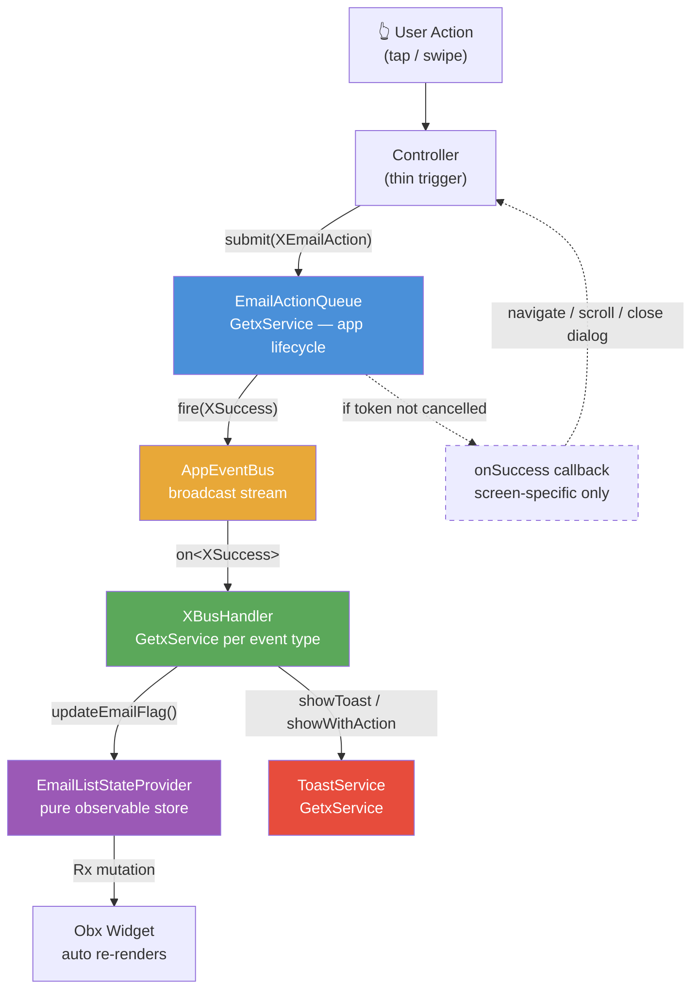
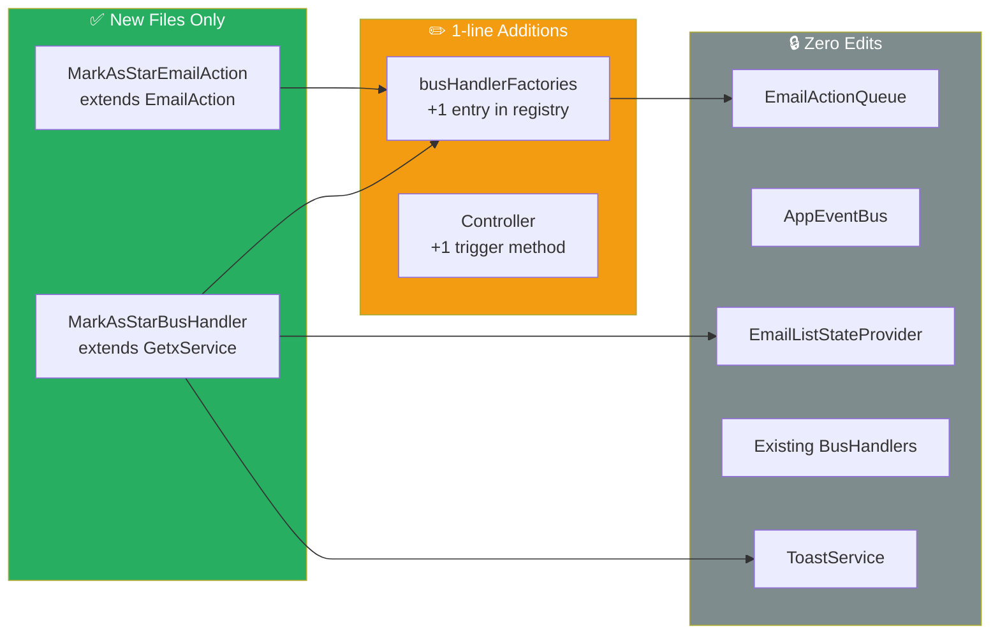
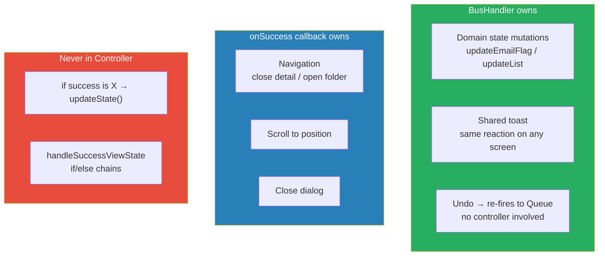
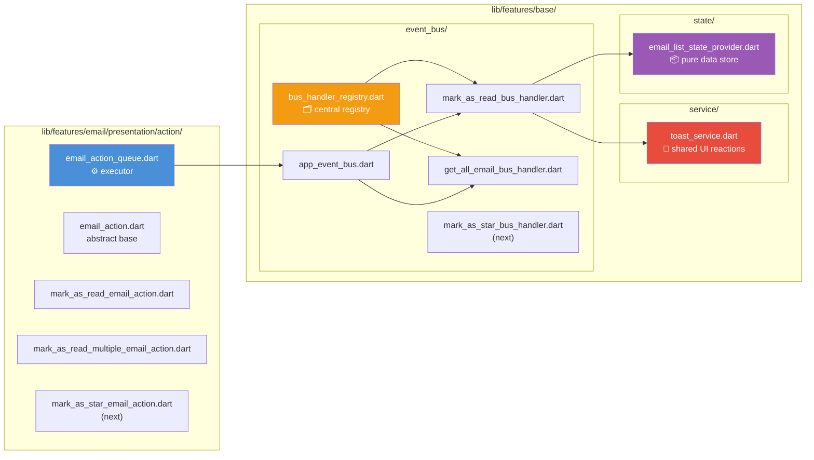

# Diagram: Controller Architecture Refactoring

## The Problem — God Controller (Before)

```ascii
┌─────────────────────────────────────────────────────────────────┐
│                  MailboxDashBoardController                      │
│                      (3,508 lines)                               │
│                                                                  │
│  ┌──────────────┐  ┌──────────────┐  ┌──────────────────────┐  │
│  │ consumeState │  │ consumeState │  │    consumeState       │  │
│  │ markAsRead   │  │ markAsStar   │  │    moveEmail ...      │  │
│  └──────┬───────┘  └──────┬───────┘  └──────────┬───────────┘  │
│         │                 │                       │              │
│         ▼                 ▼                       ▼              │
│  ┌────────────────────────────────────────────────────────────┐ │
│  │              handleSuccessViewState()                       │ │
│  │   if MarkAsReadSuccess → updateFlag()                      │ │
│  │   if MarkAsStarSuccess → updateFlag()   ← EDIT PER ACTION │ │
│  │   if MoveEmailSuccess  → updateList()                      │ │
│  │   if ArchiveSuccess    → ...                               │ │
│  └────────────────────────────────────────────────────────────┘ │
└─────────────────────────────────────────────────────────────────┘
  ↓ every new feature = edit this file
```

## The Solution — Decoupled Architecture (After)

```ascii
  User Action (tap / swipe)
         │
         ▼
  ┌─────────────────┐
  │   Controller    │  thin: submit action + onSuccess for screen-specific only
  │  (trigger only) │
  └────────┬────────┘
           │ submit(XEmailAction, onSuccess: navigate/scroll)
           ▼
  ┌──────────────────────┐
  │   EmailActionQueue   │  executes stream, always fires to bus
  │   (GetxService)      │
  └──────────┬───────────┘
             │ fire(XSuccess / XFailure)
             ▼
  ┌────────────────────┐
  │    AppEventBus     │  broadcast, app-lifecycle scope
  └──────┬─────────────┘
         │
    ┌────┴─────────────────────────┐
    │                              │
    ▼                              ▼
  ┌──────────────────┐    ┌──────────────────────┐
  │   XBusHandler    │    │   YBusHandler         │
  │  (GetxService)   │    │  (GetxService)         │
  └──────┬───────────┘    └──────────────────────┘
         │
    ┌────┴──────────────┐
    │                   │
    ▼                   ▼
  ┌────────────────┐  ┌──────────────┐
  │ StateProvider  │  │ ToastService │
  │  (pure store)  │  │ (GetxService)│
  └───────┬────────┘  └──────────────┘
          │ Rx mutation
          ▼
  ┌──────────────────┐
  │   Obx(Widget)    │  re-renders automatically
  └──────────────────┘
```

## Mermaid: Full Data Flow



## Mermaid: Adding a New Feature (OCP Compliance)



## Mermaid: Responsibility Boundaries



## Mermaid: File Structure


